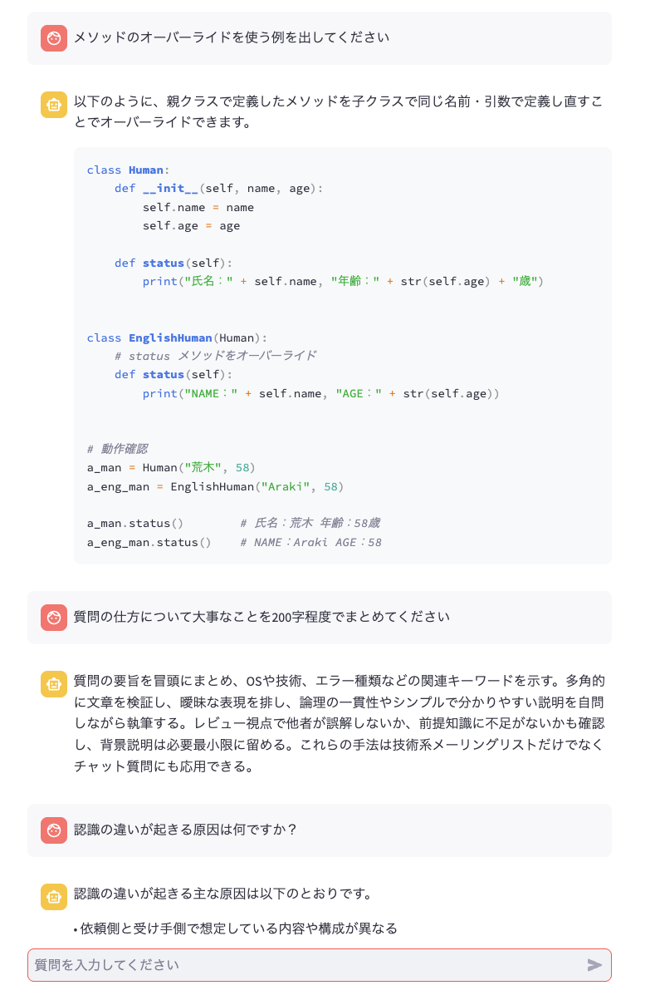

# knowledge_rag

## 概要

本リポジトリは、マークダウン形式のソースをもとに回答を行うRAGを構築します。  

datasets配下に.mdファイルを配置して、インデックス化を行い、  
streamlitでGUIを起動すると自分が学んだことをもとに回答を出すチャットボットができます。



## 技術スタック

| カテゴリ       | 技術                     |
|----------------|--------------------------|
| 言語           | Python 3.12.4               |
| フレームワーク | Streamlit                |
| LLM API        | Azure OpenAI (GPT + Embedding) |
| 検索エンジン   | Azure AI Search          |
| 分割ライブラリ | LangChain（MarkdownHeaderTextSplitter）|
| その他         | dotenv, glob, OpenAI SDK |


## 環境構築/使い方

1. 必要なパッケージをインストール

    srcディレクトリ内で次のコマンドを実行

    ```py
    pip install -r requirements.txt
    ```

2. 必要なデータを配置

    datasetsディレクトリに自分が作成したマークダウンファイルを配置する。

3. 環境変数の設定

    本リポジトリでは、Azureのサービスを使用します。  
    あらかじめ登録のうえ、.envファイル内にAPIキーを設定します。

    Azureの使い方についてはスコープ外とします。

    具体例）
    
    ```
    SEARCH_SERVICE_ENDPOINT=https://hogehoge.search.windows.net
    SEARCH_SERVICE_API_KEY=xxx
    SEARCH_SERVICE_INDEX_NAME=xxx
    AOAI_ENDPOINT=https://hogehoge.openai.azure.com/
    AOAI_API_VERSION=xxx
    AOAI_API_KEY=xxx
    AOAI_EMBEDDING_MODEL_NAME=yyy
    AOAI_CHAT_MODEL_NAME=zzz
    ```

4. インデックスを作成

    Azure AI Searchにドキュメントデータを登録します。  
    srcディレクトリ配下で次のコードを実行します。

    Azure AI Searchにインデックスが登録されれば完了です。

    ```py
    python indexer.py 
    ```

5. streamlitを立ち上げる

    同じく、srcディレクトリ配下で次のコードを実行します。

    ```py
    streamlit run orchestorator.py
    ```

    これで、自分が指定したソースから回答するチャットボットの完成です。  
    プロンプトの調整は、orchestorator.py内の`system_message_chat_conversation`を変更します。

